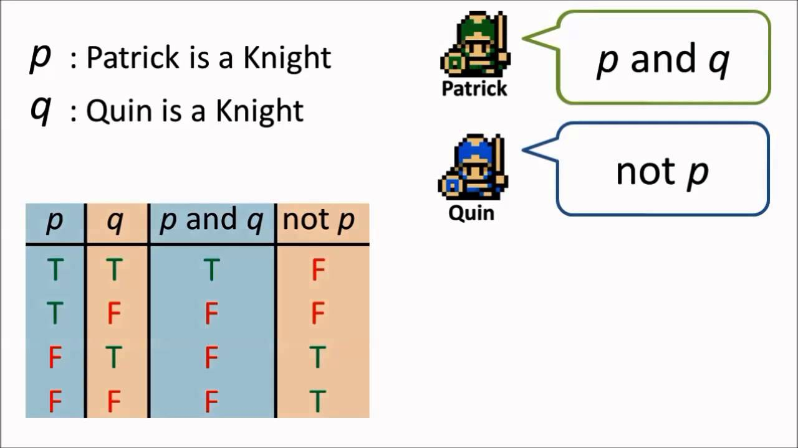

# Knights-and-Knaves
**The Knights and Knaves puzzle**



## Rules
Each character is either a knight or a knave. A knight will always tell the truth: if knight states a sentence, then that sentence is true. Conversely, a knave will always lie: if a knave states a sentence, then that sentence is false.

## Puzzles

**Puzzle 0: contains a single character, A.**
* A says “I am both a knight and a knave.”

**Puzzle 1 has two characters: A and B.**
* A says “We are both knaves.”
* B says nothing.

**Puzzle 2 has two characters: A and B.**
* A says “We are the same kind.”
* B says “We are of different kinds.”

**Puzzle 3 has three characters: A, B, and C.**
* A says either “I am a knight.” or “I am a knave.”, but you don’t know which.
* B says “A said ‘I am a knave.’”
* B then says “C is a knave.”
* C says “A is a knight.”


## Answers

**Puzzle 0:**
* A is knave

**Puzzle 1:**
* A is knave
* B is knight

**Puzzle 2:**
* A is knave
* B is knight

**Puzzle 3:**
* A is knight
* B is knave
* C is knight


## How to Run
```Bash
$ python3 puzzle.py
```